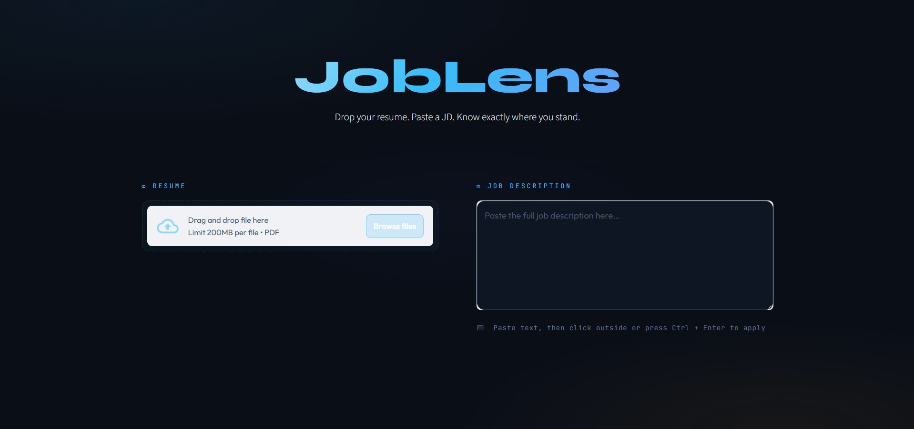
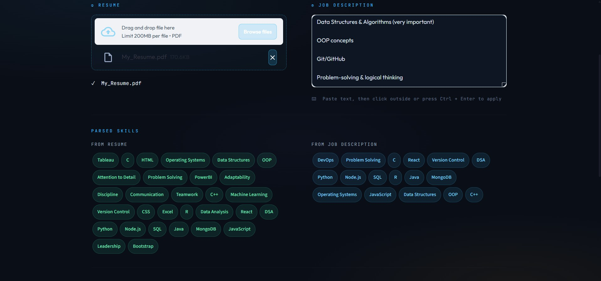
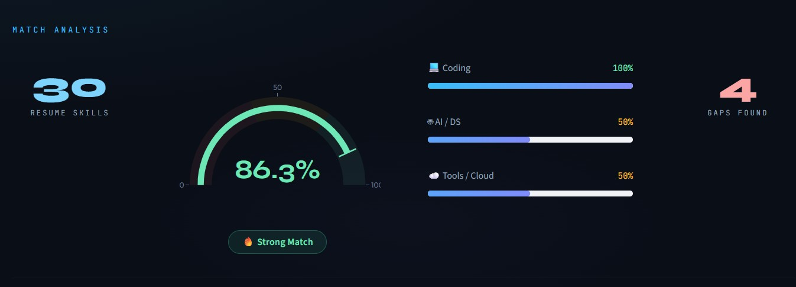
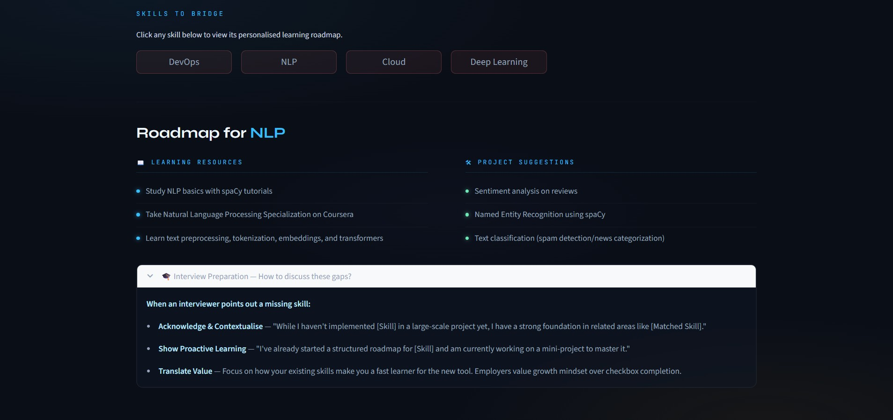

# 🎯 JobLens — AI Resume Analyzer

JobLens is an AI-powered web application that analyzes resumes against job descriptions, computes a match score using semantic similarity, identifies skill gaps, and provides personalized learning resources and project suggestions.

---

## 🚀 Features

- Upload PDF Resume
- Paste Job Description
- AI-based semantic skill matching using Sentence Transformers
- Match score visualization (gauge + category breakdown)
- Missing skill detection
- Personalized learning roadmap (resources + projects)
- Modern UI built with Streamlit

---

## 🧠 How It Works

1. Resume text is extracted from the uploaded PDF
2. Skills are extracted from both resume and job description
3. A transformer model converts skills into embeddings
4. Cosine similarity is computed between resume and JD skills
5. Match score is calculated as average similarity
6. Skills below a threshold are marked as missing
7. Learning resources and project ideas are suggested

---

## 🛠️ Tech Stack

- **Python**
- **Streamlit** — UI framework  
- **Sentence Transformers** — semantic similarity  
- **PyPDF2** — PDF parsing  
- **Plotly** — data visualization  

---

## 🧠 AI Component

This project uses the `all-MiniLM-L6-v2` model from Sentence Transformers to generate embeddings for skills and compute semantic similarity using cosine distance.

This allows the system to:
- Understand meaning (not just exact keywords)
- Match related skills (e.g., *ML ↔ Machine Learning*)
- Provide more intelligent analysis

---

## ▶️ Run Locally

```bash
pip install -r requirements.txt
streamlit run app.py

## 📸 Screenshots

### 🏠 Home Screen


### 🧠 Parsed Skills


### 📊 Match Analysis


### 🚀 Roadmap & Tips


## 📌 Future Improvements

- Hybrid skill extraction (combine rule-based + AI for higher accuracy)
- Context-aware matching using full resume and job description embeddings
- Resume feedback system (suggest improvements, not just missing skills)
- Experience-level analysis (beginner vs intermediate vs expert skills)
- Cloud deployment (Streamlit Cloud / AWS / Docker)
- User authentication & resume history tracking
- Support for multiple file formats (DOCX, TXT)
- Performance optimization using caching and batching
- Improve threshold tuning for better match accuracy

## ⭐ Project Status

🚧 Actively Developed

This project is fully functional and demonstrates end-to-end resume analysis using NLP and semantic similarity.

Future updates will focus on improving skill extraction accuracy, adding advanced AI features, and deploying the application for public use.